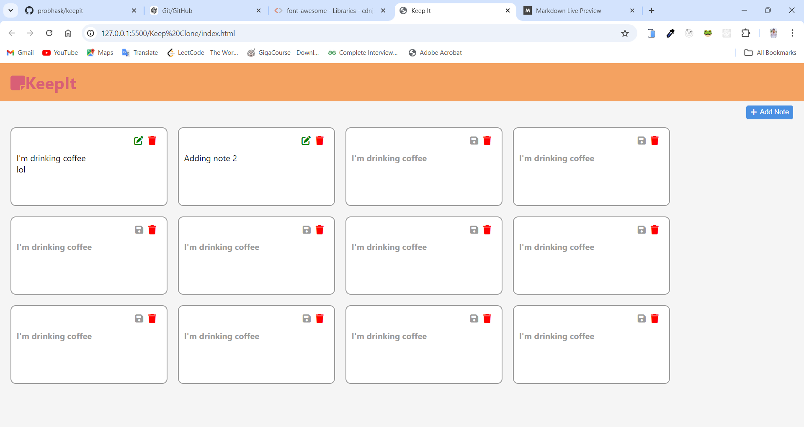

# KeepIt - Notes Taking Application

## Project Description
**KeepIt** is a simple web-based note-taking application that allows users to create, edit, and delete notes. Notes are saved locally in the browser's `localStorage`, ensuring persistence between sessions. The app features a minimalistic design with user-friendly interactions and responsive layout, making it accessible on both desktop and mobile devices.

## GitHub Pages Deployed Link
[Visit Live Project 🔗](https://probhask.github.io/keepit/)
```bash
https://probhask.github.io/keepit/
```



## Features
- **Add Notes**: Users can add new notes with a single click.
- **Edit Notes**: Users can edit any note by clicking the edit button.
- **Save Notes**: Edited notes can be saved.
- **Delete Notes**: Users can delete any note, which also removes it from `localStorage`.
- **Local Persistence**: Notes are stored in the browser using `localStorage` and will persist across sessions.
- **Responsive Design**: The app is fully responsive and adapts to different screen sizes.
- **Dynamic Note Creation**: Notes are created dynamically using a template.

## Technologies Used
- **HTML5**: Provides the basic structure and layout of the app.
- **CSS3**: Styles the application with a focus on responsiveness and user experience.
- **JavaScript (ES6)**: Handles the core logic for adding, editing, saving, and deleting notes.
- **Font Awesome**: Used for iconography in buttons and the header.
- **LocalStorage API**: Used for saving notes locally in the browser.

## File Structure
```
project-folder/
│
├── index.html    # Main HTML file. Defines the structure of the application, includes the header, buttons, and notes section.
├── style.css     # Main CSS file for styling. Contains all the styling for the app, including layout, colors, and responsiveness.
├── script.js     # Main JavaScript file for functionality. Contains the JavaScript logic that powers the note-taking functionality, including adding, editing, and saving notes to `localStorage`.
└── README.md     # Project documentation
```


## How to Run the Project
1. Clone the repository or download the project files.
2. Open `index.html` in any modern web browser.


## Usage
- **Add Note**: Click the "Add Note" button to create a new note.
- **Edit Note**: Click the pencil icon on any note to make changes.
- **Save Note**: After editing a note, click the save button to store changes.
- **Delete Note**: Click the trash icon to delete a note permanently.

## Future Improvements
- Add the ability to categorize notes.
- Add a search functionality to quickly find notes.


